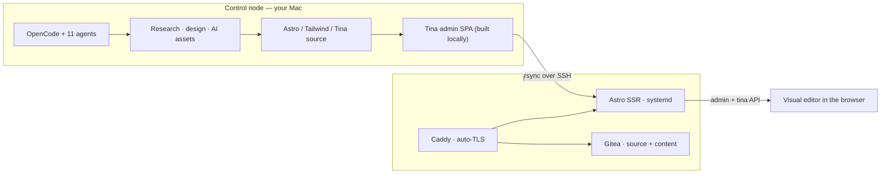
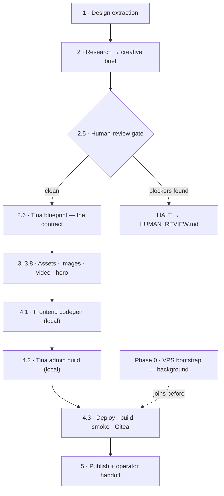
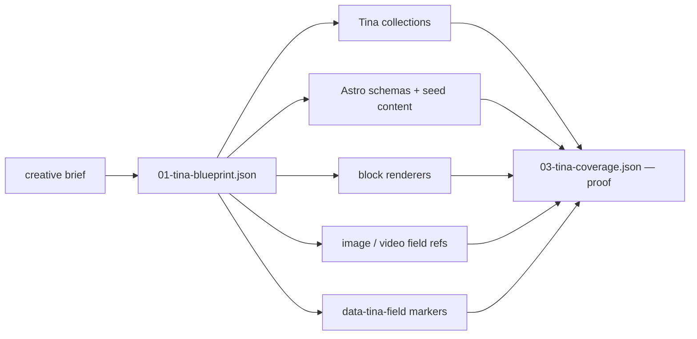

<div align="center">

# 🛰️ astro-static

### From one sentence to a live, visually-editable website — built and deployed by a team of AI agents.

*A multi-agent [OpenCode](https://opencode.ai) pipeline that researches your brand, extracts design DNA, generates the visuals, writes an **Astro 7 + Tailwind v4** site with self-hosted **TinaCMS** visual editing, and ships it to **your own VPS** — with a contract check at every single step.*

<br/>


</div>

---

## 💡 The pitch

You give one agent a short brief — *"a dark, cinematic site for my canoe-trip bar in Canoa Quebrada, here's the Instagram"* — and a server to deploy to. It comes back with a **live, production website you can edit in your browser**, on a domain that works instantly, with TLS, version control, and an admin panel — no theme, no template, no hand-holding.

Under the hood it's not one prompt. It's a **coordinated team of eleven specialist agents** moving through a **13-phase, fail-closed pipeline**, where every phase emits a typed JSON artifact and a Python validator refuses to continue if anything is off-contract.

> **Why "fail-closed" matters:** most AI site builders happily ship a page that *looks* right but has hardcoded text, dead image paths, and an editor with no fields wired up. This pipeline is built specifically to make that impossible — see [the Tina-first contract](#-the-tina-first-contract-the-core-idea).

---

## ✨ What you get

| | |
|---|---|
| 🧠 **Brand-aware** | Researches the business, extracts design tokens from reference sites & Instagram, writes a real creative brief |
| 🎨 **Generated visuals** | Logo, favicons, OG image, theme CSS, content images (AI or scraped), optional looping video backgrounds & a branded hero intro |
| ✏️ **Actually editable** | Self-hosted TinaCMS visual editing — click any text/image on the live site and edit it. No "lorem ipsum you can't change." |
| ⚡ **Modern stack** | Astro 7 islands, Tailwind v4 CSS-first theming, statically prerendered pages with SSR only where Tina needs it |
| 🚀 **Real deployment** | Your Debian VPS, Caddy auto-TLS, Gitea source control, a systemd SSR service, smoke-tested live |
| 🌐 **Instant domain** | Free `*.sslip.io` hostname on first deploy — real DNS, real HTTPS, zero registrar — upgrade to your domain later with one step |
| 🔁 **Resumable** | Crash, close the laptop, come back — it picks up at the first unfinished phase |
| 🔒 **Safe by default** | Secrets stay `0600` and never leave the box; the VPS is hardened (SSH, fail2ban, auto security updates) on first boot |

---

## 🏗️ How it works

Two machines. Your **control node** does all the thinking, generation, and building. The **VPS** only ever receives finished artifacts and serves them.



**Why this split?** The 2 GB VPS would get OOM-killed building the Tina admin SPA, so that happens on your Mac. Public pages are statically prerendered; only the `/admin` and `/api/tina/*` routes run through the Node SSR adapter. The result is fast static delivery *and* live editing.

---

## 🔄 The pipeline

Thirteen phases. The slow VPS bootstrap runs **in the background** while local research and asset work happen, and only joins right before deploy. A **human-review gate** stops the line before any money is spent on generation if the brief has contradictions.



<details>
<summary><b>Full phase table</b> — canonical IDs, what each one owns</summary>

<br/>

| # | Phase ID | What it does |
|---|---|---|
| 0 | `0_bootstrap_launch` | Launches VPS setup in the background (apt, Gitea, Node, Bun, Caddy) |
| 1 | `1_design_extraction` | Extracts W3C design tokens + section patterns from reference URLs / Instagram |
| 2 | `2_research` | Produces `01-creative-brief.json` — strategy, content model, recommendations |
| 2.5 | `2_5_brief_validation` | **Human gate** — halts on contradictions or unverifiable claims |
| 2.6 | `2_6_tina_blueprint` | Deterministic editable-surface contract (`01-tina-blueprint.json`) |
| 3 | `3_asset_generation` | Logo, favicons, OG image, theme CSS, fonts, asset manifest |
| 3.5 | `3_5_image_generation` | Field-ref-aware content images + LQIP placeholders (AI or scraped) |
| 3.6 | `3_6_video_generation` | Optional Tina-editable looping video backgrounds |
| 3.8 | `3_8_hyperframes_hero_optional` | Optional branded kinetic-typography intro video (local, $0) |
| 4.1 | `4_1_frontend_codegen` | Local Astro 7 / Tailwind / Tina source generation — **never deploys** |
| 4.2 | `4_2_tinacms_local_build` | Builds the Tina admin SPA locally (dodges VPS OOM) |
| 4.3 | `4_3_build_deploy` | Bootstrap join → rsync → remote build → SSR restart → smoke → Gitea push |
| 5 | `5_publish_result` | Strict final validation, redacted `RESULT.md`, operator handoff |

</details>

---

## 🧬 The Tina-first contract (the core idea)

The centerpiece. Before a single asset is generated or a line of code is written, the creative brief is compiled into one canonical artifact:

```
pipeline/01-tina-blueprint.json   ←  the editable-surface contract
```

Everything downstream is *derived* from it — Tina collections, Astro content schemas, block renderers, image/video field references, the `data-tina-field` click-to-edit markers — and then `pipeline/03-tina-coverage.json` is produced to **prove every editable field is actually wired end to end.**



This single decision is what kills the classic "looks done, isn't editable" failure mode.

<details>
<summary><b>The artifacts the pipeline passes between agents</b></summary>

<br/>

| Artifact | Purpose |
|---|---|
| `pipeline/00-brief.json` | The human seed (project, client, site type, references) |
| `pipeline/01-creative-brief.json` | Researched strategy + content model + review flags |
| `pipeline/01-tina-blueprint.json` | **Canonical editable-surface model** |
| `pipeline/02-image-shot-list.json` | Image plan with `field_ref` mappings |
| `pipeline/02-video-shot-list.json` | Optional video plan with `field_ref` mappings |
| `pipeline/02-asset-manifest.json` | Generated assets, defaults, Tina media metadata |
| `pipeline/03-tina-coverage.json` | Schema / content / renderer / island / marker proof |
| `pipeline/vps-connection.json` | Connection + credentials (`0600`, gitignored, never printed) |

Every one is schema-validated by `validate-pipeline.py`. JSON Schemas live in `agents/astro-static/schemas/`.

</details>

---

## 🤖 The agent team

One primary orchestrator owns phase state and dispatch; ten subagents do the specialized work. Agents communicate through pipeline artifacts and a machine-readable `STATUS:<TOKEN>` grammar — not freeform chat.

| Agent | Role |
|---|---|
| 🧭 `orchestrator` | **Primary.** Phase state, dispatch, gates, retries, final publication |
| 🔬 `researcher` | Brand/business/content research → creative brief |
| 🎨 `design-extractor` | Reference-site & Instagram token / section-pattern extraction |
| 🖼️ `asset-generator` | Identity assets, theme CSS, font config, image/video shot coordination |
| 📷 `img-gen` | PPQ image-generation worker |
| 🎬 `vid-gen` | PPQ video-generation worker (text-to-video & image-to-video) |
| ✦ `hyperframes-vid-gen` | Deterministic local hero-intro MP4 (HTML + GSAP + headless Chrome) |
| 📸 `instagram-extractor` | Instagram profile/content extraction path |
| 🏗️ `frontend-builder` | Local-only Astro/Tailwind/Tina source generator (never deploys) |
| 🚀 `build-deployer` | VPS join, rsync, remote build, SSR restart, smoke, final validation |
| 🔍 `auditor` | Read-only pipeline/state/config audit when a phase is stuck |

---

## 🧱 The stack

| Layer | Choice |
|---|---|
| Framework | **Astro 7** (islands, content collections) |
| Styling | **Tailwind v4** — CSS-first `@theme {}` tokens |
| CMS / editor | **Self-hosted TinaCMS** with visual editing (`@tinacms/datalayer`, `MemoryLevel`, `FilesystemBridge`) |
| Runtime | Static prerender + **Astro Node SSR** for `/admin` and `/api/tina/*` |
| Images | Sharp WebP/AVIF at build · pngquant/jpegoptim · LQIP placeholders |
| Server | **Debian 13** · **Caddy** (auto-TLS) · **Gitea** · systemd SSR service |
| Media gen | PPQ image/video models with deterministic local fallbacks |
| Free domain | `*.sslip.io` — instant real DNS, no registrar |

> Exact, tested version ranges live in [`references/reference-stack.md`](agents/astro-static/references/reference-stack.md) and are enforced on every generated `package.json`.

---

## 🚀 Quickstart

**1. Install into OpenCode**

```bash
git clone https://github.com/lostsock1/astro-static.git
cd astro-static
./sync.sh install          # deploys the agents, commands, scripts & model toolkit
```

**2. Build a site** — in OpenCode, run the command (or just talk to the orchestrator):

```
/astro-static/new-site
```

Give it a brief and a server it can SSH to:

```jsonc
// the seed it needs
{
  "project_name": "freedom-bar",
  "client_name":  "Freedom Bar Canoa Quebrada",
  "site_type":    "hospitality / bar",
  "reference_urls":   ["https://example-bar.com"],
  "instagram_handle": "@freedombar",
  "vps": { "ssh_host": "vm-1100.example.cloud", "ssh_user": "debian" }
}
```

**3. Get back live URLs** — site, Gitea repo, and `…/admin/` visual editor. Edit content in the browser; the `git-sync` watcher auto-commits and rebuilds.

---

## 🗂️ Repository layout & sync

This repo is the **single source of truth** — no duplicated copies. `sync.sh` installs each part into its OpenCode location and can detect drift.

```text
.
├── agents/astro-static/        # canonical source for the agent stack
│   ├── *.md                    #   orchestrator + 10 subagents
│   ├── schemas/                #   pipeline artifact JSON Schemas
│   ├── references/             #   stack / pipeline / transformation contracts
│   └── scripts/                #   validators, setup-vps, phase scripts
├── commands/astro-static/      # installable OpenCode slash commands
├── models/                     # self-contained PPQ model-lookup toolkit
├── sync.sh                     # install into / diff against the live config
└── README.md
```

| `sync.sh` maps | → installs to |
|---|---|
| `agents/astro-static/` (minus `scripts/`) | `~/.config/opencode/agents/astro-static/` |
| `agents/astro-static/scripts/` | `~/.config/opencode/astro-static/` |
| `models/` | `~/.config/opencode/astro-static/models/` |
| `commands/astro-static/` | `~/.config/opencode/commands/astro-static/` |

```bash
./sync.sh install   # repo  → live OpenCode config
./sync.sh status    # show any drift (by content checksum)
./sync.sh pull      # rescue edits made directly under ~/.config/opencode
```

**Authoring loop:** edit here → `./sync.sh install` → test in OpenCode → `git commit` → `git push`. Override the target with `OPENCODE_CONFIG_DIR=…`. Never edit the live copies directly.

---

## 🛡️ Fail-closed validation

`validate-pipeline.py` is the enforcement layer — ~40 checks across six phase gates, backed by **108 regression tests** that encode real failures found in live runs. It rejects, among many others:

- a Tina blueprint that's missing before assets/codegen, or missing settings/nav/footer fields
- visible text with no Tina field marker, or media paths not backed by a Tina/content/manifest field
- hardcoded marketing copy arrays or service bullets
- an invalid Tina auth provider shape (the infamous `undefined.name` crash)
- a Tina island route exporting `ALL` instead of `POST`
- SSR deploy checks wrongly demanding `dist/client/index.html`
- generated output, logs, env files, or **secrets** being pushed to Gitea
- a `package.json` that drifts off the tested release line

```bash
python3 agents/astro-static/scripts/test_regressions.py
# Ran 108 tests — OK
```

<details>
<summary><b>🔬 Inner workings</b> — the engineering that makes it reliable</summary>

<br/>

- **`STATUS:<TOKEN>` grammar** — every script/agent emits machine-parseable status lines (`^STATUS:([A-Z_][A-Z0-9_]*)(.*)$`). Agents branch on the last `STATUS:` line, never on prose.
- **Retry-dedupe** — a `(phase, error-hash)` ledger allows exactly one retry of an identical failure, then halts. A stuck agent can't burn the whole retry budget spinning on one error.
- **Concurrency** — Phase 0 bootstraps the VPS in the background (`nohup`, single coalesced SSH replacing 80+ short connections) while Phases 1–4.2 do pure local work; the join is deferred to right before deploy.
- **Local Tina build** — the admin SPA is built on the control node and published as-is, because esbuild OOM-kills on the 2 GB VPS.
- **Self-hosted Tina** — `@tinacms/datalayer` + `MemoryLevel` (pure JS, no native bindings) + `FilesystemBridge`; content indexed in memory on server start.
- **Secret handling** — `vps-connection.json`, bootstrap results, install logs and summaries are mode `0600`; `RESULT.md`/`STATUS.md`/logs never print passwords, tokens, or keys.
- **VPS hardening** (idempotent, first-boot) — SSH daemon lockdown (key-only, no root, modern KEX), fail2ban (sshd + recidive jails), unattended security upgrades. Skippable with `HARDENING_SKIP=true`; never locks the operator out.
- **Domain upgrade** — start on a free `*.sslip.io` host, then point a real domain at the IP and re-run the project phases; content, Gitea history and Tina edits are preserved.
- **Idempotent everything** — `setup-vps.sh` is safe on fresh or warm servers; the Gitea push handles redirects, slow links, rebases on remote content edits, and falls back to an SSH git-bundle.

</details>

---

## 🧪 Development & contributing

The schemas, validators, agent prompts, references, and regression tests are **one contract** — change them together.

```bash
# full pre-publish check
python3 agents/astro-static/scripts/test_regressions.py        # 108 tests
S=agents/astro-static/scripts
python3 -m py_compile $S/validate-pipeline.py $S/test_regressions.py $S/phases/tina-blueprint.py
bash -n $S/setup-vps.sh $S/bg-bootstrap.sh
for p in asset-fallbacks bootstrap-join ppq-auth push-gitea retry smoke tinacms-local-build; do
  bash -n "$S/phases/$p.sh"
done
```

**Discipline**

- When you add a phase or artifact, update `references/pipeline-contract.md`, the schemas, the validator, the tests, **and** this README — together.
- Edit only under `agents/astro-static/` and `commands/astro-static/`; deploy with `./sync.sh install`.
- Keep generated media editable: carry `field_ref`, `content_path`, and Tina default metadata through the asset pipeline.
- Never print or commit secrets from `pipeline/vps-connection.json`, bootstrap logs, OpenCode auth, SSH keys, or PPQ credentials.

<div align="center">

---

*Built for [OpenCode](https://opencode.ai). Phase-gated, resumable, fail-closed.*

</div>
